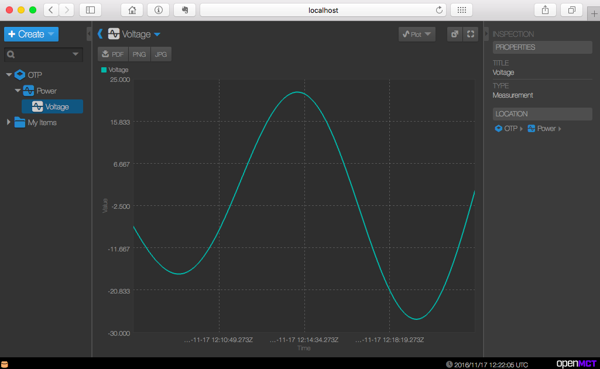

# Open Telemetry Provider

[](https://app.wercker.com/project/byKey/8b9d7c2d939aaf7bdbe5ae392ae2d513)
[](https://godoc.org/github.com/crgimenes/openTelemetryProvider)

Simple and easy to use telemetry provider to use with NASA OpenMCT

## Install

```
go get -u github.com/crgimenes/openTelemetryProvider
```

## Example




Taxonomy dictionary file *dictionary.json*
```json
{
    "name": "OTP",
    "identifier": "board",
    "subsystems": [
        {
            "name": "Power",
            "identifier": "pwr",
            "measurements": [
                {
                    "name": "Voltage",
                    "identifier": "pwr.v",
                    "units": "V",
                    "type": "float"
                }
            ]
        }
    ]
}
```

App example

```go
package main

import (
	"fmt"
	"log"
	"math"
	"os"
	"os/signal"

	otp "github.com/crgimenes/openTelemetryProvider"
)

func main() {

	go func() {
		sc := make(chan os.Signal, 1)
		signal.Notify(sc, os.Interrupt)
		<-sc
		// close all connections
		otp.CloseAll()

		fmt.Print("\n")
		log.Println("Have a nice day!")
		os.Exit(0)
	}()

	otp.LoadTaxonomyDictionaryFromFile("./dictionary.json")
	otp.SubsystemHandleFunc("pwr.v", pwrvFunc)
	otp.ListenAndServe(8081, 1000)

}

var x float64

func pwrvFunc() {
	x += 0.01
	y := math.Sin(x) * (x / 2.0 * math.Pi)
	otp.SetDataValue("pwr.v", otp.MakeTimestamp(), y)
}
```

## Contributing

- Fork the repo on GitHub
- Clone the project to your own machine
- Create a *branch* with your modifications `git checkout -b fantastic-feature`.
- Then _commit_ your changes `git commit -m 'Implementation of new fantastic feature'`
- Make a _push_ to your _branch_ `git push origin fantastic-feature`.
- Submit a **Pull Request** so that we can review your changes
